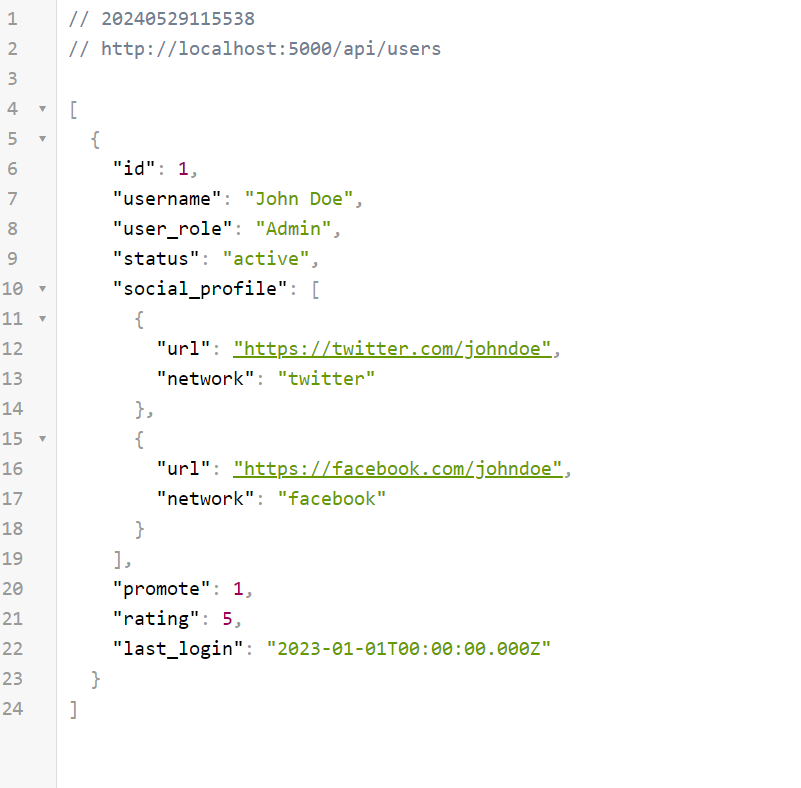
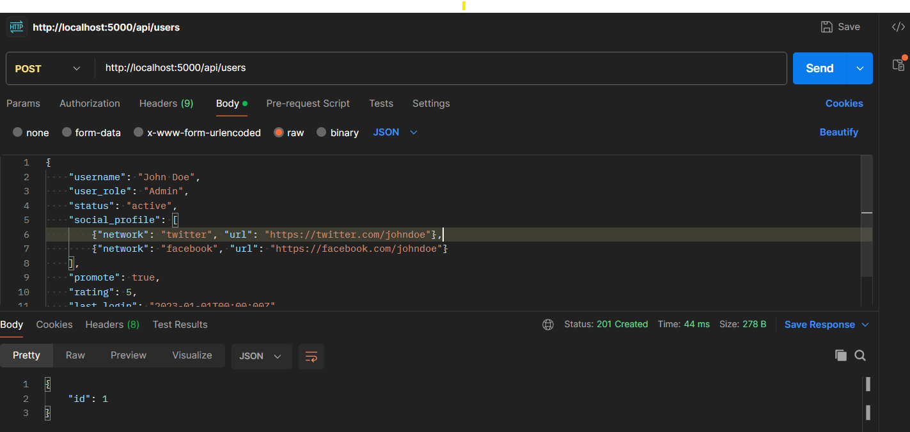
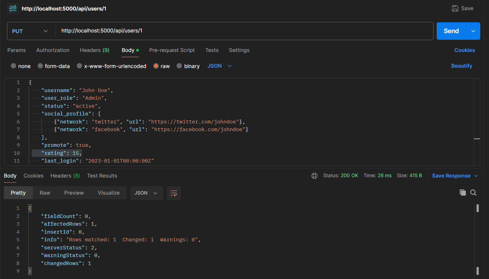
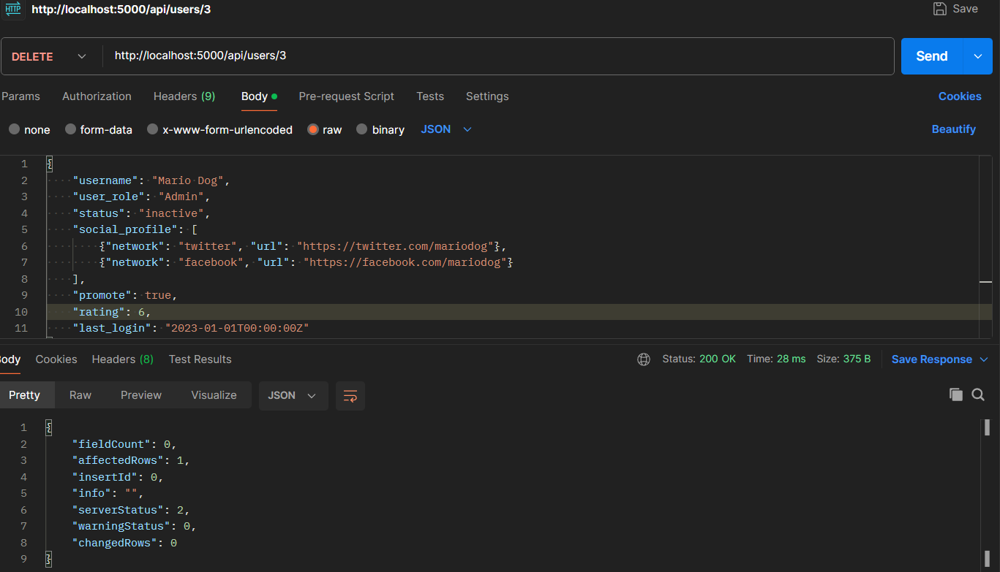
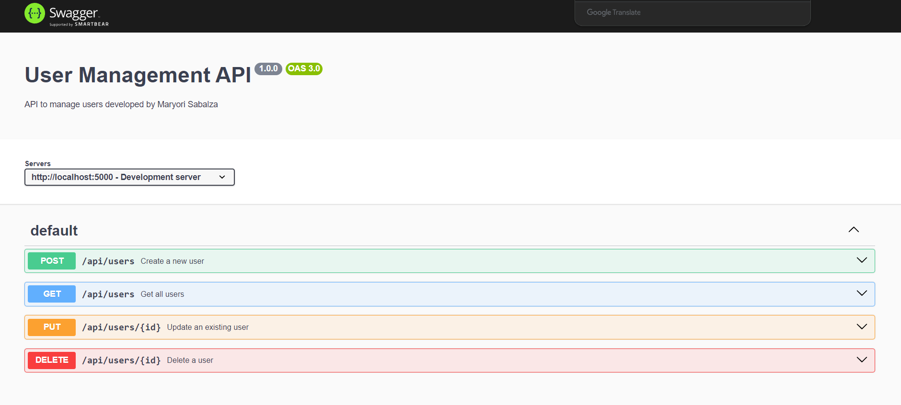

# Backend

Create using Node.

## DATABASE
Enter to mysql command line and create the database.

```sql
- CREATE DATABASE user_management;
- USE user_management;

- CREATE TABLE IF NOT EXISTS users (
        id INT AUTO_INCREMENT PRIMARY KEY,
        username VARCHAR(255) NOT NULL,
        user_role VARCHAR(100),
        status ENUM('active', 'inactive') DEFAULT 'active',
        social_profile JSON,
        promote BOOLEAN DEFAULT false,
        rating INT DEFAULT 0,
        last_login DATETIME
    );
```

## Run the app

- node server.js´

Go to http://localhost:5000/api/users


## API CRUD

- GET



- POST



- PUT



- DELETE



## Documentation 

Go to http://localhost:5000/docs/

